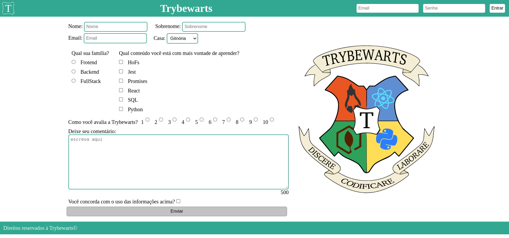

# Projeto trybewallet

## [Clique aqui](https://trybewarts-pi.vercel.app/) para acessar o App

## Observação
este foi um projeto em dupla, eu fiz junto com o [Pedro Mendes](https://github.com/alt-art), e eu posso dizer que eu adorei o trabalho em dupla.

## Descrição
uma página de formulário da Escola de Magia de Trybewarts, em que as pessoas estudantes poderão enviar seus feedbacks sobre ela. 

## Habilidades
Neste projeto, formos capaz de:

Criar formulários em HTML;
Utilizar CSS Flexbox para criar layouts flexíveis;
Criar regras CSS específicas para serem aplicadas a dispositivos móveis;
Construir páginas que alteram o seu layout de acordo com a orientação da tela;

## Tecnologias Utilizadas:
|HTML|CSS|JavaScript|
|-|-|-|
||||
|Sintaxe JSX|Utilizado na estilização das páginas e dos componentes com styled components|Aplicação das funcionalidades|
___

